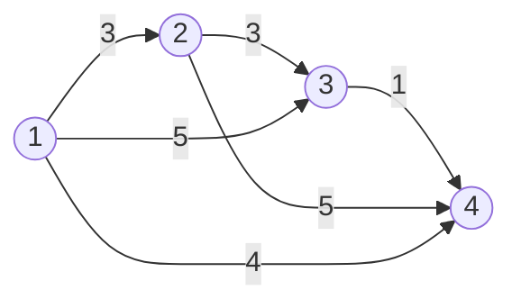

# 1504번 특정한 최단 경로
https://www.acmicpc.net/problem/1504

## 풀이

1. **방향성이 없는** (즉, 양방향) 그래프
2. 주어진 서로 다른 v1, v2 정점을 반드시 거쳐야한다.
3.  1 -> N 까지 최단거리를 구하라.

예제
4 6
1 2 3
2 3 3
3 4 1
1 3 5
2 4 5
1 4 4
2 3


출발점 1번에서 2번노드와 3번노드를 반드시 거쳐서 4번노드로 가는 최단거리를 구해야한다.

위 조건에 부합하는 경우의 수를 보면

**1 -> v1 -> v2 -> N** -- (1)
**1 -> v2 -> v1 -> N**  -- (2)

두 가지 경우가 있다.
따라서
1. 1번 노드를 출발점으로 해서 가지는 최단거리
2. v1번 노드를 출발점으로 해서 가지는 최단거리
3. v2번 노드를 출발점으로 해서 가지는 최단거리   

를 구하게 되면 (1)과 (2)를 구할 수 있고, (1)과 (2)의 중 최단거리를 출력하면 된다.

## 구현


```java
//간선에 대한 정보를 담을 class를 정의한다.
static class Vertice{
		int next;
		int dist;
		public Vertice(int next, int dist) {
			super();
			this.next = next;
			this.dist = dist;
		}
	}
	
	static int N, E;
	static List<Vertice>[] list;
	static int[][] dist;
	static final int MAX = 200000001;//모든 간선을 거치면서 가질 수 있는 최대값
	public static void main(String[] args) {
		Scan sc = new Scan();
		
		N = sc.nextInt();
		E = sc.nextInt();
		
		list = new ArrayList[N+1];
		dist = new int[N+1][N+1];
		
		for(int i=1; i<=N; i++) {
			list[i] = new ArrayList<Vertice>();
			Arrays.fill(dist[i], MAX);
		}
		
		for(int i=0; i<E; i++) {
			int from = sc.nextInt();
			int to = sc.nextInt();
			int dist = sc.nextInt();
			//방향성이 없다 -> 양방향이다.
			list[from].add(new Vertice(to, dist));
			list[to].add(new Vertice(from, dist));
		}
		//경유지
		int viaFirst = sc.nextInt();
		int viaSecond = sc.nextInt();
		
		//출발점, v1, v2 최단거리를 구한다
		setShortestDist(1);
		setShortestDist(viaFirst);
		setShortestDist(viaSecond);
		
		
		int result = Math.min(dist[1][viaFirst]+dist[viaFirst][viaSecond]+dist[viaSecond][N],
				dist[1][viaSecond]+dist[viaSecond][viaFirst]+dist[viaFirst][N]);
		
		
		System.out.println(result < MAX ? result : -1);
		
	}

	private static void setShortestDist(int start) {
	//오름정렬 되도록 PQ선언
		PriorityQueue<Vertice> pq = new PriorityQueue<Vertice>(new Comparator<Vertice>() {
			@Override
			public int compare(Vertice o1, Vertice o2) {
				return o1.dist - o2.dist;
			}
		});
		//start -> start 거리 0
		dist[start][start] = 0;
		//출발 지점 저장
		pq.add(new Vertice(start, 0));
		
		while(!pq.isEmpty()) {
			Vertice curr = pq.poll();
			
			for(Vertice next : list[curr.next]) {
				if(dist[start][next.next] > dist[start][curr.next] + next.dist) {
					dist[start][next.next] =  dist[start][curr.next] + next.dist;
					pq.add(new Vertice(next.next, dist[start][next.next]));
				}
			}
		}
	}
}
```