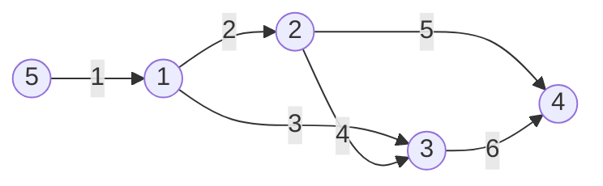

# 1753번 최단경로
https://www.acmicpc.net/problem/1753

## 풀이

1번 정점으로 부터 주어진 모든 정점에 대한 거리를 구하라

예제
5 6
1
5 1 1
1 2 2
1 3 3
2 3 4
2 4 5
3 4 6


다익스트라 알고리즘을 구현하는 가장 기본적인 문제


## 구현

```java
//간선에 대한 정보를 담을 class를 정의한다.
static class Vertice{
		int next;
		int weight;
		public Vertice(int next, int weight) {
			super();
			this.next = next;
			this.weight = weight;
		}
	}
	static int V,E,TOP;
	//노드와 간선 list 
	static List<Vertice>[] vertices;
	//최소 거리를 저장할 array
	static int[] D;
	static final int MAX = 3000001;
	public static void main(String[] args) {
		Scan sc = new Scan();
		
		V = sc.nextInt();
		E = sc.nextInt();
		TOP = sc.nextInt();
		
		vertices = new ArrayList[V+1];
		D = new int[V+1];
		
		for(int i=1; i<=V; i++){
			vertices[i] = new ArrayList<>();
			D[i] = MAX; // 최단거리를 저장하기 위해 초기 값은 MAX로 지정
		}
		
		for(int i=0; i<E; i++){
		//단방향 간선이기 때문에 from - to - weight 값 list 에 저장
			vertices[sc.nextInt()].add(new Vertice(sc.nextInt(), sc.nextInt()));
		}
		
		PriorityQueue<Vertice> pq = new PriorityQueue<>(new Comparator<Vertice>() {
		//최소값이 가장 위에 오도록 queue 정의
			@Override
			public int compare(Vertice o1, Vertice o2) {
				return o1.weight - o2.weight;
			}
		});
		//1 -> 1 값 0으로 저장
		D[TOP] = 0;
		//시작점 que에 add
		pq.add(new Vertice(TOP, 0));
		
		while(!pq.isEmpty()){
			Vertice v = pq.poll();
			
			for(Vertice next : vertices[v.next]){
				if(D[next.next] > D[v.next] + next.weight){
					D[next.next] = D[v.next] + next.weight;
					pq.add(new Vertice(next.next, D[next.next]));
				}
			}
		}
		
		for(int i=1; i<=V; i++){
			if(D[i] == MAX) System.out.println("INF");
			else System.out.println(D[i]);
		}
	}
```