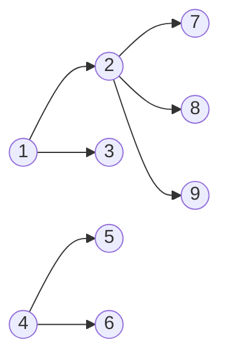

# 2644번 촌수계산
https://www.acmicpc.net/problem/2644

## 풀이

여러 사람들에 대한 부모 자식들 간의 관계가 주어졌을 때, 주어진 두 사람의 촌수를 계산하는 프로그램 작성.

예제
7과 3의 촌수 계산
1 -> 2
1 -> 3
2 -> 7
2 -> 8
2 -> 9
4 -> 5
4 -> 6

각 노드 간 거리를 1로 놓고, 주어진 노드 3 -> 7 까지의 거리를 구하면 된다.

3에서 시작해서 3과 k노드가 부모 자식 관계가 있는 지를 확인하고, 촌수를 계산한다. (이미 계산한 촌수는 계산할 필요가 없다.) 그리고 다시 k노드를 중심으로 반복하여 관계도를 완성한다.

--> 3과 7의 촌수를 출력한다.

## 구현

```java
	static int n, personA, personB, m;
	static int[][] relations; //관계 값 저장
	static int[] dist; // 촌수 계상 array
	public static void main(String[] args) {
		Scan sc = new Scan();
		
		
		n = sc.nextInt();
		personA = sc.nextInt();
		personB = sc.nextInt();
		m = sc.nextInt();
		
		dist = new int[n+1];
		relations = new int[n+1][n+1];
		for(int i=0; i<=n; i++) {
			Arrays.fill(dist, -1); //관계가 없는 경우 촌수 -1로 설정
		}
		
		Queue<Integer> q = new LinkedList<Integer>();
		
		
		for(int i=0; i<m; i++) {
			int a = sc.nextInt();
			int b = sc.nextInt();
			
			relations[a][b] = 1;
			relations[b][a] = 1;
		}
		//시작점 personA 추가 및 personA 촌수 0
		q.add(personA);
		dist[personA] = 0;
		while(!q.isEmpty()) {
			int now = q.poll();
			
			if(now == personB) break;
			
			for(int next=1; next<=n; next++) {
				//관계가 있고 && 촌수를 계산 안한경우 -> 값 갱신 및 que에 추가
				if(relations[now][next] > 0 && dist[next] < 0 ) {
					dist[next] = dist[now] + 1;
					q.add(next);
				}
			}
		}
		System.out.println(dist[personB]);
	}
```