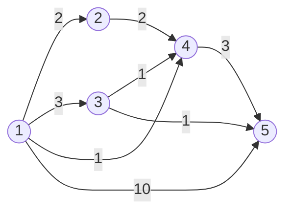

# 11779번 최소비용 구하기 2
https://www.acmicpc.net/problem/11779

## 풀이

1. **단방향**  그래프
2.  A -> B 가는 데 드는 최소비용과 **경로**
3.  최소비용을 구하는 것과 **경로를 어떻게 찾을 것인가?**


예제
5
8
1 2 2
1 3 3
1 4 1
1 5 10
2 4 2
3 4 1
3 5 1
4 5 3
1 5


**경로를 어떻게 찾을 것인가?**
1. 경유하는 도시를 저장하는 array가 필요하다.
2. 최단 경로를 갱신할 때마다 경유지에 대한 이전 도시의 번호를 해당 array에 저장해 준다.
3. 도착지에서 array에 저장된 도시 번호를 추적하여 출발지까지 찾아간다.

즉 ,위 그래프에서 정답이 될 수 있는 경로는

1 -> 4 -> 5

(1) distance[5]  값이 갱신 될 때,  city[5] = 4가 되고,
(2) distance[4]의 값이 갱신 될 때, city[4] = 1이 된다.

따라서, city[5]부터 값을 따라 출발지까지 추적해가면 경로를 구할 수 있다.

## 구현


```java
public class Boj11779 {
	static class Scan{
		BufferedReader br;
		StringTokenizer st;
		
		public Scan() {
			br = new BufferedReader(new InputStreamReader(System.in));
		}
		
		public String next(){
			while(st == null || !st.hasMoreTokens()){
				try {
					st = new StringTokenizer(br.readLine());
				} catch (IOException e) {
					e.printStackTrace();
				}
				
			}
			return st.nextToken();
		}
		
		public int nextInt(){
			return Integer.parseInt(next());
		}
	}
	//버스 class 정의
	static class Bus{
		int to;
		int cost;
		public Bus(int to, int cost) {
			super();
			this.to = to;
			this.cost = cost;
		}
	}
	
	static int N, M;
	static List<Bus>[] list; //버스의 경로를 저장할 list[]
	static int start, end;
	static int[] sumCost; // 최소값을 저장할 array
	static int[] viaCity; // 경유지를 저장할 array
	static final int MAX = 100000001;
	public static void main(String[] args) {
		Scan sc = new Scan();
		
		N = sc.nextInt();
		M = sc.nextInt();
		
		sumCost = new int[N+1];
		list = new ArrayList[N+1];
		viaCity = new int[N+1];
		
		for(int i=1; i<=N; i++) {
			list[i] = new ArrayList<Bus>();
		}
		Arrays.fill(sumCost, MAX);
		
		for(int i=0; i<M; i++) {
			int from = sc.nextInt();
			int to = sc.nextInt();
			int dist = sc.nextInt();
			//단반향
			list[from].add(new Bus(to, dist));
		}
		
		start = sc.nextInt();
		end = sc.nextInt();
		
		PriorityQueue<Bus> pq = new PriorityQueue<Bus>(new Comparator<Bus>() {

			@Override
			public int compare(Bus o1, Bus o2) {
				// TODO Auto-generated method stub
				return o1.cost - o2.cost;
			}
		});
		
		pq.add(new Bus(start, 0));
		sumCost[start] = 0;
		
		while(!pq.isEmpty()) {
			Bus currBus = pq.poll();
						
			for(Bus nextBus : list[currBus.to]) {
				if(sumCost[nextBus.to] > sumCost[currBus.to] + nextBus.cost) {
					sumCost[nextBus.to] = sumCost[currBus.to] + nextBus.cost;
					//최단거리가 갱신 될 때마다, 경로 또한 저장
					viaCity[nextBus.to] = currBus.to;
					pq.add(new Bus(nextBus.to, sumCost[nextBus.to]));
				}
			}
		}
		
		List<Integer> viaCityList = new ArrayList<Integer>();
		
		//도착지부터 역순으로 찾아가는 과정
		int via = end;
		viaCityList.add(via);
		while(via != start) {
			via = viaCity[via];
			viaCityList.add(via);
		}
		
		System.out.println(sumCost[end]);
		System.out.println(viaCityList.size());
		for(int i = viaCityList.size()-1; i > -1; i--) {
			// 뒤에서 부터 출력해준다.
			System.out.printf("%d ", viaCityList.get(i));
		}
		
	}
}
```