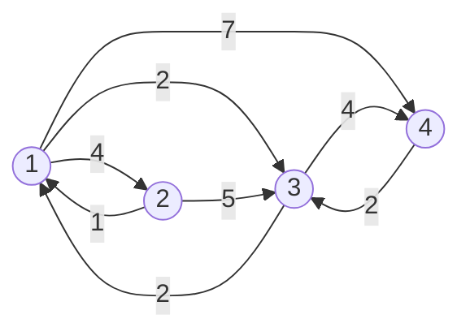

# 1238번 The Other Way
https://www.acmicpc.net/problem/1238

## 조건

1. **단방향**  그래프
2.  A -> B -> A에 대한 최단 시간
3.  N명의 학생 중 왕복 시간이 가장 많은 시간을 소비하는 학생을 구하라.

예제
4 8 2
1 2 4
1 3 2
1 4 7
2 1 1
2 3 5
3 1 2
3 4 4
4 2 3


## 풀이 
**K번 학생은 K번 마을에 산다.**

1.  1~N번까지 각각 최단 시간을 모두 구한다.
--> 따라서, N개의 최단 시간을 저장할 2차원 배열이 필요하다.

3. K 번째 학생의 최단 시간은 K -> X -> K 이다. 

4.  1~N번까지 최단 시간을 비교하여 최대 값을 찾는다.

## 구현


```java
public class Boj1238 {
	static class Scan{
		BufferedReader br;
		StringTokenizer st;
		
		public Scan() {
			br = new BufferedReader(new InputStreamReader(System.in));
		}
		
		public String next(){
			while(st == null || !st.hasMoreTokens()){
				try {
					st = new StringTokenizer(br.readLine());
				} catch (IOException e) {
					e.printStackTrace();
				}
				
			}
			return st.nextToken();
		}
		
		public int nextInt(){
			return Integer.parseInt(next());
		}
		
	}
	//마을 정보를 담을 class
	static class Town{
		int next;
		int dist;
		public Town(int next, int dist) {
			super();
			this.next = next;
			this.dist = dist;
		}
	}
	
	static int N, M, X;
	static List<Town>[] list; // 마을 간의 정보를 담을 list[]
	static List<Town>[] listBack; // 마을 간의 정보를 담을 list[]
	static int[][] distance;
	public static void main(String[] args) {
		Scan sc = new Scan();
		
		N = sc.nextInt();
		M = sc.nextInt();
		X = sc.nextInt();
		
		list = new ArrayList[N+1];
		distance = new int[2][N+1];
		
		for(int i=1; i<=N; i++) {
			list[i] = new ArrayList<Town>();
			listBack[i] = new ArrayList<Town>();
		}
		Arrays.fill(distance[0], Integer.MAX_VALUE);
		Arrays.fill(distance[1], Integer.MAX_VALUE);
		
		for(int i=0; i<M; i++) {
			int from = sc.nextInt();
			int to = sc.nextInt();
			int dist = sc.nextInt();
			
			list[from].add(new Town(to, dist));
			listBack[to].add(new Town(from, dist));
		}
		
		dijkstra(list, 0);
		dijkstra(listBack, 1);
		
		int result = 0;
		
		for(int i=1; i<=N; i++) {
			result = Math.max(result, distance[0][i] + distance[1][i]);
		}
		
		System.out.println(result);
	}
	
	private static void dijkstra(List<Town>[] list, int order) {
		PriorityQueue<Town> pq = new PriorityQueue<Town>(new Comparator<Town>() {

			@Override
			public int compare(Town o1, Town o2) {
				return o1.dist - o2.dist;
			}
		});
		//start 지점부터 모든 경로에 대한 최단 시간을 구한다.
		distance[order][1] = 0;
		pq.add(new Town(1, 0));
		
		while(!pq.isEmpty()) {
			Town t = pq.poll();
			
			for(Town nextTown : list[t.next]) {
				if(distance[order][nextTown.next] > distance[order][t.next] + nextTown.dist) {
					distance[order][nextTown.next] = distance[order][t.next] + nextTown.dist;
					pq.add(new Town(nextTown.next, distance[order][nextTown.next]));
				}
			}
		}
		
	}
}

```