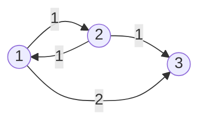

# 14554번 The Other Way
https://www.acmicpc.net/problem/14554

## 조건

1. **양방향**  그래프
2.  A -> B 최단 경로의 가짓수를 1000000009로 나눈 나머지
3.  도로의 길이 C ( 1 <= C <= 1000000000)
 --> **long** 자료형을 써야하나 int로 써도 풀린다.......

예제
3 4 1 3
1 2 1
2 1 1
2 3 1
1 3 2


## 풀이 
**경로의 가짓수를 어떻게 구할 것인가?**

1.  k번 마을까지의 최단 경로 가짓수를 저장할 array가 필요하다.

2. 시작점(S)에서 갖는 경로의 가짓수는 1.

3.  k-1번 마을에서 k번 마을까지 가는 최단 경로가 갱신 된다면  k번까지 가는 최단 경로의 수는 k-1번 마을까지 가는 방법의 수와 동일하다.

4. k-2번 마을에서 k번 마을까지 가는 최단 경로의 수와 기존에 k번 마을까지 가는 최단 경로의 수가 동일하다면,
--> k번 마을까지 가는 최단 경로의 수는 k번 마을가지 가는 경로의 수 + k-2번 마을가지 가는 경로의 수가 된다.

## 구현


```java
public class Boj14554 {
	static class Scan{
		BufferedReader br;
		StringTokenizer st;
		
		public Scan() {
			br = new BufferedReader(new InputStreamReader(System.in));
		}
		
		public String next(){
			while(st == null || !st.hasMoreTokens()){
				try {
					st = new StringTokenizer(br.readLine());
				} catch (IOException e) {
					e.printStackTrace();
				}
				
			}
			return st.nextToken();
		}
		
		public int nextInt(){
			return Integer.parseInt(next());
		}
		
	}
	//마을 class
	static class Town{
		int next;
		long dist;
		public Town(int next, long dist) {
			super();
			this.next = next;
			this.dist = dist;
		}
	}
	
	static final int  DIVIDER = 1000000009;
	static int N, M, S, E;
	static List<Town>[] list; // 마을 간의 경로를 저장할 list[]
	static long[] cost; // 최단 경로의 값을 저장할 array
	static int[] numWays; // 경로의 개수를 저장할 array
	public static void main(String[] args) {
		Scan sc = new Scan();
		
		N = sc.nextInt();
		M = sc.nextInt();
		S = sc.nextInt();
		E = sc.nextInt();
		
		list = new ArrayList[N+1];
		cost = new long[N+1];
		numWays = new int[N+1];
		
		for(int i=1; i<=N; i++) {
			list[i] = new ArrayList<Town>();
		}
		Arrays.fill(cost, Long.MAX_VALUE);
		
		
		for(int i=0; i<M; i++) {
			int curr = sc.nextInt();
			int next = sc.nextInt();
			long dist = sc.nextInt();
			list[curr].add(new Town(next, dist));
			list[next].add(new Town(curr, dist));
		}
		
		PriorityQueue<Town> pq = new PriorityQueue<Town>((a, b) -> Long.compare(a.dist, b.dist));
		
		cost[S] = 0;
		numWays[S] = 1; // S -> S 경로의 수 1
		pq.add(new Town(S, 0));
		
		
		while(!pq.isEmpty()) {
			Town currTown = pq.poll();
			
			// currTown의 dist가 cost보다 크다면 pass
			if(currTown.dist > cost[currTown.next]) continue;
			
			for(Town nextTown : list[currTown.next]) {
				long nextCost = cost[currTown.next] + nextTown.dist;
				
				if(cost[nextTown.next] > nextCost) {
					cost[nextTown.next] = nextCost;
					//nextTown까지 가는 경로의 수는 currTown까지 온 경로의 수와 같다.
					numWays[nextTown.next] = numWays[currTown.next];
					
					pq.add(new Town(nextTown.next, nextCost));
					
				}else if(cost[nextTown.next] == nextCost) {
					//cost가 같다면 curr -> next로 가는 경로도 최단 경로이므로, currTown의 경로의 수를 더해준다.
					numWays[nextTown.next] = (numWays[nextTown.next] + numWays[currTown.next]) % DIVIDER;
				}
			}
		}
		System.out.println(numWays[E]);
	}
}
```