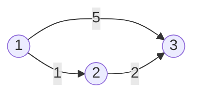

# 13907번 세금
https://www.acmicpc.net/problem/13907

## 조건   
                                                
1. 통행료의 합이 가장 적은 경로로 이동.
2. 도로마다 통행료에 대한 세금을 인상함.
3. 여러 단계에 거쳐서 세금을 올리고, 모든 도로의 통행료가 인상된 세금만큼 동일하게 인상된다.


예제
3 3 2
1 3
1 3 5
1 2 1
2 3 2
1
2



## 풀이 
**1162번 도로 포장 문제와 유사**   
1. 세금을 인상할 때 최소 비용에 영향을 주는 요소?    
* **도로의 수**   
--> 세금이 1 오른다고 할지라도 10개의 도로를 거친다면, 총 10의 비용이 더 발생하게 된다.   

2. S -> D까지 최소 비용 구간을 구하는 데 있어서 몇 개의 도로를 거쳐서 갔는 지가 중요하다.   

3. S -> D 구간은 최소 1개 ~ 최대 N개의 도로를 거쳐서 갈 수 있다.   

4. 최소 비용을 저장할 2차원 배열이 필요하다.   
--> cost[도시번호][도로의 수]      

5. 다음 도시에 갈 때마다 지나간 도로의 수가 늘어나므로,   
--> cost[다음 도시번호][현재 도로의 수+1] = cost[현재 도시번호][현재 도로의 수] + 도로의 cost   
식으로 값을 갱신해준다.


## 구현


```java
public class Boj13907 {
	static class Scan{
		BufferedReader br;
		StringTokenizer st;
		
		public Scan() {
			br = new BufferedReader(new InputStreamReader(System.in));
		}
		
		public String next(){
			while(st == null || !st.hasMoreTokens()){
				try {
					st = new StringTokenizer(br.readLine());
				} catch (IOException e) {
					e.printStackTrace();
				}
				
			}
			return st.nextToken();
		}
		
		public int nextInt(){
			return Integer.parseInt(next());
		}
	}
	
	static class Road{
		int num;
		int cost;
		int cnt;
		public Road(int num, int cost) {
			super();
			this.num = num;
			this.cost = cost;
			this.cnt = 0;
		}
		public Road(int num, int cost, int cnt) {
			super();
			this.num = num;
			this.cost = cost;
			this.cnt = cnt;
		}
		@Override
		public String toString() {
			return "Road [num=" + num + ", cost=" + cost + ", cnt=" + cnt + "]";
		}
		
	}
	
	static int N, M, K, S, D;
	static List<Road>[] list;
	static int[][] costs;
	public static void main(String[] args) {
		Scan sc = new Scan();
		
		N = sc.nextInt();
		M = sc.nextInt();
		K = sc.nextInt();
		S = sc.nextInt();
		D = sc.nextInt();
		
		list = new ArrayList[N+1];
		costs = new int[N+1][N+1];// 도시, 도로의 수에 따른 값 저장할 2차원 배열
		
		for(int i=1; i<=N; i++) {
			list[i] = new ArrayList<Road>(); 
			Arrays.fill(costs[i], Integer.MAX_VALUE);
		}
		
		for(int i=0; i<M; i++) {
			int from = sc.nextInt();
			int to = sc.nextInt();
			int cost = sc.nextInt();
			
			list[from].add(new Road(to, cost));
			list[to].add(new Road(from, cost));
		}
		

		PriorityQueue<Road> pq = new PriorityQueue<Road>(new Comparator<Road>() {
			@Override
			public int compare(Road o1, Road o2) {
				// TODO Auto-generated method stub
				return o1.cost - o2.cost;
			}
		});
		costs[S][0] = 0;
		pq.add(new Road(S, 0));
		
		int result = Integer.MAX_VALUE;
		int max = 0;
		while(!pq.isEmpty()) {
			Road curr = pq.poll();
			boolean isHigher = false;
			// 도로의 수가 더 적거나 같은데 cost중에 현재 비용보다 더 작다면 최소 비용이 될 수 없으므로 pass
			for(int i=0; i <= curr.cnt; i++) {
				if(costs[curr.num][i] < curr.cost) {
					isHigher = true;
					break;
				}
			}
			
			if(isHigher) continue;
			
			if(curr.num == D) {
				max = Math.max(max, curr.cnt);
				result = Math.min(result, costs[curr.num][curr.cnt]);
				continue;
			}
			
			for(Road next : list[curr.num]) {
				if(curr.cnt + 1 <= N && costs[next.num][curr.cnt+1] > costs[curr.num][curr.cnt] + next.cost) {
					costs[next.num][curr.cnt+1] = costs[curr.num][curr.cnt] + next.cost;
					pq.add(new Road(next.num, costs[next.num][curr.cnt+1], curr.cnt+1));
				}
			}
		}
		System.out.println(result);
		
		int accmulation = 0;
		for(int i=0; i<K; i++) {
			int p = sc.nextInt();
			accmulation += p;
			result = Integer.MAX_VALUE;
			
			for(int j=1; j<=max; j++) {
				if(costs[D][j] == Integer.MAX_VALUE) continue;
				
				result = Math.min(result, costs[D][j] + j*accmulation);
			}
			System.out.println(result);
		}
	}
}
```