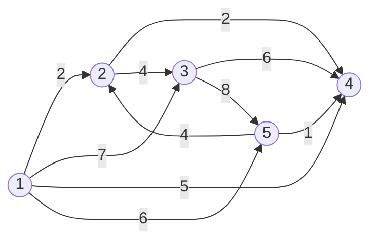

# 1854번 K번째 최단경로 찾기
https://www.acmicpc.net/problem/1854

## 조건   
                                                
1. k번째 최단경로 찾기

예제
5 10 2
1 2 2
1 3 7
1 4 5
1 5 6
2 4 2
2 3 4
3 4 6
3 5 8
5 2 4
5 4 1


## 풀이 

1. **k번째 최단경로를 구하라.**
--> k번째 최단경로를 구하기 위해선 첫 번째부터 K 번째까지 최단거리를 구해야한다.
2. i 도시에 도착할 때마다 그 값을 저장한다.
(1) 1 ~ K 번째까지는 i 도시에 도착하는 값을 저장하고,
(2) K번 이후에도 i 도시에 도착하는 경우가 있다면, 
--> i 도시 저장한 값 중 제일 큰 값과 비교하여 더 작다면 큰 값은 버리고 작은 값을 저장한다.
3.   b도시에 K번째 최단경로를 출력한다.

## 구현


```java
public class Boj1854 {
	static class Scan {
		BufferedReader br;
		StringTokenizer st;

		public Scan() {
			br = new BufferedReader(new InputStreamReader(System.in));
		}

		public String next() {
			while (st == null || !st.hasMoreTokens()) {
				try {
					st = new StringTokenizer(br.readLine());
				} catch (IOException e) {
					e.printStackTrace();
				}

			}
			return st.nextToken();
		}

		public int nextInt() {
			return Integer.parseInt(next());
		}

		public double nextDouble() {
			return Double.parseDouble(next());
		}
	}

	static class Vertice {
		int num;
		int dist;
		public Vertice(int num, int dist) {
			super();
			this.num = num;
			this.dist = dist;
		}
	}
	
	static int N, M, K;
	static List<Vertice>[] list;
	static PriorityQueue<Integer>[] dist;
	public static void main(String[] args) {
		Scan sc = new Scan();
		
		N = sc.nextInt();
		M = sc.nextInt();
		K = sc.nextInt();
		
		list = new ArrayList[N+1];
		dist = new PriorityQueue[N+1];
		
		for(int i=1; i<=N; i++) {
			list[i] = new ArrayList<Vertice>();
			dist[i] = new PriorityQueue<Integer>(new Comparator<Integer>() {
				@Override
				public int compare(Integer o1, Integer o2) {
					return o2 - o1;
				}
			});
		}
		
		for(int i=0; i<M; i++) {
			int from = sc.nextInt();
			int to = sc.nextInt();
			int dist = sc.nextInt();
			
			list[from].add(new Vertice(to, dist));
		}
		
		PriorityQueue<Vertice> pq = new PriorityQueue<Vertice>(new Comparator<Vertice>() {

			@Override
			public int compare(Vertice o1, Vertice o2) {
				return o1.dist - o2.dist;
			}
		});
		
		dist[1].add(0);
		pq.add(new Vertice(1, 0));
		
		List<Integer> result = new ArrayList<Integer>();
		while(!pq.isEmpty()) {
			Vertice curr = pq.poll();
			
			for(Vertice next : list[curr.num]) {
				int minDist = dist[next.num].peek() == null ? Integer.MAX_VALUE : dist[next.num].peek();
				
				if(dist[next.num].size() < K || minDist > curr.dist + next.dist) {
					if(dist[next.num].size() == K) dist[next.num].poll();
					minDist = curr.dist + next.dist;
					dist[next.num].add(minDist);
					pq.add(new Vertice(next.num, minDist));
				}
			}
		}
		
		for(int i=1; i<=N; i++) {
			if(dist[i].size() < K) System.out.println(-1);
			else System.out.println(dist[i].peek());
		}
	}
}
```