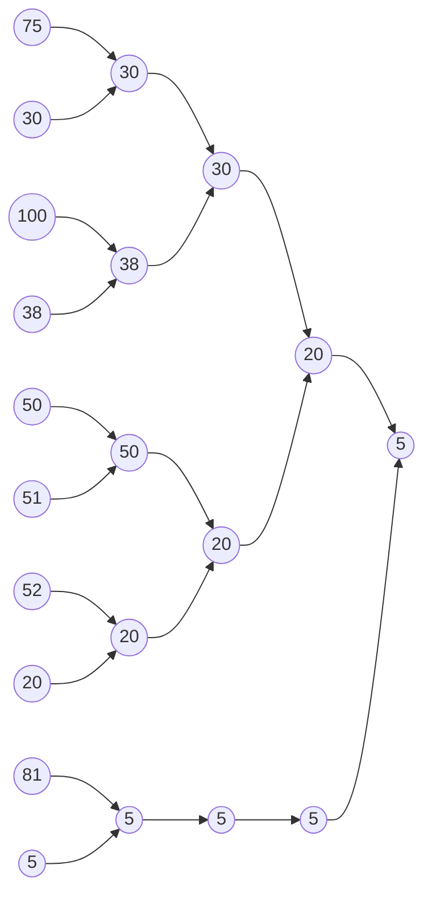

# 2357번 최솟값과 최댓값
https://www.acmicpc.net/problem/2357

## 조건

1. N <= 100,000개의 정수.
2. 최소, 최대 쌍 M <= 100,000개를 찾아라.


## 풀이

1. 세그먼트 트리를 구성한다.
2. 최솟값, 최댓값에 대한 트리 2개 구성.
3. 최소 트리는 리프노드에서 더 작은 값을 부모 노드로 계속 올려보낸다.
4. 최대 트리는 리프노드에서 더 큰 값을 부모 노드로 계속 올려보낸다.
5. a, b가 주어졌을 때 최소 트리, 최대 트리에서 각 a~b까지 탐색하여 값을 출력한다.


예제
10 4
75
30
100
38
50
51
52
20
81
5
1 10
3 5
6 9
8 10

* Min tree



## 구현


```java
public class Boj2357 {
	static class Scan{
		BufferedReader br;
		StringTokenizer st;
		
		public Scan() {
			br = new BufferedReader(new InputStreamReader(System.in));
		}
		
		public String next(){
			while(st == null || !st.hasMoreTokens()){
				try {
					st = new StringTokenizer(br.readLine());
				} catch (IOException e) {
					e.printStackTrace();
				}
				
			}
			return st.nextToken();
		}
		
		public int nextInt(){
			return Integer.parseInt(next());
		}
		public long nextLong() {
			return Long.parseLong(next());
		}
	}
	
	static int N, M, n;
	static long[] minNums;
	static long[] maxNums;
	
	public static void main(String[] args) {
		
		Scan sc = new Scan();
		N = sc.nextInt();
		M = sc.nextInt();
		
		int length = 0;
		n = 1;
		
		while(true) {
			length += n;
			
			if(n >= N) {
				break;
			}
			
			n *= 2;
		}
		n--;
		
		minNums = new long[length+1];
		maxNums = new long[length+1];
		Arrays.fill(minNums, Long.MAX_VALUE);
		Arrays.fill(maxNums, 0);
		for(int i=1; i<=N; i++) {
			maxNums[n+i] = minNums[n+i] = sc.nextLong();
		}
		
		for(int i=n; i>0; i--) {
			minNums[i] = Math.min(minNums[i*2], minNums[i*2+1]);
			maxNums[i] = Math.max(maxNums[i*2], maxNums[i*2+1]);
		}
		
		long min = 0;
		long max = 0;
		for(int i=0; i<M; i++) {
			int from = sc.nextInt();
			int to = sc.nextInt();
			
			min = findMin(from, to);
			max = findMax(from, to);
			System.out.println(min+" "+max);
		}
		
	}

	private static long findMax(int from, int to) {
		long max = 0;
		from = from + n;
		to = to + n;
		
		while(from <= to) {
			
			if(from % 2 == 1) {
				max = Math.max(max, maxNums[from]);
			}
			
			if(to % 2 == 0) {
				max = Math.max(max, maxNums[to]);
			}
			from = (from+1) /2;
			to = (to-1) /2;
		}
		
		return max;
	}

	private static long findMin(int from, int to) {
		long min = Long.MAX_VALUE;
		from = from + n;
		to = to + n;
		
		while(from <= to) {
			
			if(from % 2 == 1) {
				min = Math.min(min, minNums[from]);
			}
			
			if(to % 2 == 0) {
				min = Math.min(min, minNums[to]);
			}
			
			from = (from+1) /2;
			to = (to-1) /2;
		}
		
		return min;
	}
}

```